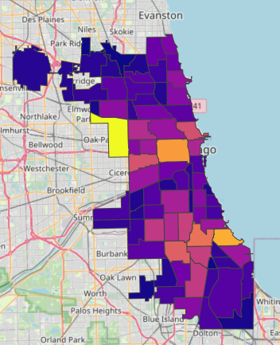

# Chicago Crime Analytics

A local, open-source data lake and analytics UI for the City of Chicago "Crimes - 2001 to Present" dataset. Ingestion runs on demand against the Socrata SODA API and stores a partitioned Parquet lake on disk. The Dash app reads only the local Parquet lake.

This repository was almost entirely generated with ChatGPT. An initial [prompt](prompts/entries/2026-01-03-session-1.md) handled the basic setup, and AI was used to troubleshoot/resolve errors, with only slight tweaks made manually.

## Dashboard overview

The Dash analytics UI provides:
- Time series trends by day or week
- Top primary crime types
- Day-of-week vs hour-of-day heatmap
- Interactive map with automatic downsampling
- Arrest rate by primary type
- Filter controls for date range, primary type, district, and arrest/domestic flags



## Recommended: Superset (BI)

Superset is the recommended BI layer. Ingest stays on the host (venv), and Superset runs in Docker with a read-only mount of the local lake.

### Setup Ingest (host venv)

```bash
cp .env.example .env
make install
make ingest
make dims
make duckdb
```

### Setup Superset (Docker)

```bash
cp .env.superset.example .env.superset
make superset-up
make duckdb-superset
```

The `make duckdb-superset` target:
1. Builds the Superset image (including duckdb-engine, pyarrow)
2. Runs `build_duckdb_container.py` inside a container with a **writable** `/data` mount
3. Builds DuckDB views that Superset can query via the read-only `/data` mount

### Connect Superset to DuckDB

Open http://localhost:8088 (default `admin` / `admin`), then add a database:

- **Type**: DuckDB
- **SQLAlchemy URI**: `duckdb:////data/lake/chicago_crime.duckdb?read_only=true`

Available datasets (views):
- `crimes`
- `crimes_enriched`
- `community_areas`
- `population`
- `acs_demographics`

### Re-ingest and sync DuckDB

After running new data ingest or updating dimensions on the host:

```bash
make duckdb-superset
```

This rebuilds the DuckDB views inside the container so Superset sees the latest data.

## Setup (local)

```bash
python3 -m venv .venv
. .venv/bin/activate
pip install -e ".[dev]"
cp .env.example .env
```

Run a one-off ingest:

```bash
make ingest
```

Full backfill (re-fetch from `START_DATE` and rebuild affected partitions):

```bash
python -m chicago_crime.ingest.ingest_crimes --once --full-backfill
```

If you want to pin a start date and keep the process running while your Mac is locked:

```bash
START_DATE=2001-01-01 caffeinate -s python -m chicago_crime.ingest.ingest_crimes --once --full-backfill
```

Run the Dash app:

```bash
make app
```

Startup/shutdown helpers (venv-first ingest):

```bash
./scripts/startup.sh
./scripts/shutdown.sh
```

## Legacy Dash (Docker)

Build images:

```bash
docker compose build
```

Run the app:

```bash
docker compose up
```

For production scheduling, run the ingest command from the host (cron, systemd timers, GitHub Actions runner) and keep the `data/` directory persistent.

## Data lake layout

Partitioned by year/month/day under `./data/lake/crimes/`:

```
data/
  lake/
    crimes/
      year=YYYY/
        month=MM/
          day=DD/
            *.parquet
  state/
    ingest_state.json
  staging/
```

## Community areas GeoJSON cache

The app uses Chicago Community Area boundaries for choropleths. The GeoJSON and a matching dimension table are cached under:

```
data/
  dim/
    community_areas/
      community_areas.geojson
      community_areas.parquet
```

Refresh boundaries manually:

```bash
python -m chicago_crime.ingest.ingest_dimensions --force
```

The choropleth joins crimes to boundaries via `feature["id"]` derived from the `area_num_1` property and matches it to `community_area`.

## ACS population + demographics dims

The ingest pipeline can cache population and ACS demographic fields (by community area) from the Chicago Data Portal:

- Most recent year: `7umk-8dtw`
- Multi-year: `t68z-cikk` (optional, keep latest year per area)

Cached dim files:

```
data/
  dim/
    population/
      community_area_population.parquet
    acs_demographics/
      acs_demographics.parquet
```

Queries left-join these dims onto crimes using `TRY_CAST(c.community_area AS INTEGER) = dim.community_area`.

To refresh all dims:

```bash
make dims
```

## Map modes

The dashboard supports an auto mode that chooses points for small ranges and choropleth for larger ranges. You can manually switch between points and choropleth in the sidebar controls.

## Configuration

Environment variables (see `.env.example`):

- `CHI_CRIME_DATASET_ID` (default `ijzp-q8t2`)
- `SODA_APP_TOKEN` (optional, recommended for higher rate limits)
- `START_DATE` (ISO timestamp, default `today - 365 days` if lake is empty)
- `BACKFILL_DAYS` (default `14`)
- `PAGE_LIMIT` (default `50000`)
- `DATA_DIR` (default `./data`)
- `LOG_LEVEL` (default `INFO`)
- `DASH_HOST` (default `0.0.0.0`)
- `DASH_PORT` (default `8050`)
- `MAX_MAP_POINTS` (default `25000`)
- `MAP_MAX_DAYS_POINTS` (default `90`)
- `COMMUNITY_AREAS_DATASET_ID` (default `igwz-8jzy`)
- `COMMUNITY_AREAS_GEOJSON_URL` (GeoJSON export endpoint)
- `COMMUNITY_AREA_NUMBER_FIELD` (default `area_num_1`)
- `COMMUNITY_AREA_NAME_FIELD` (default `community`)
- `DIM_MAX_AGE_DAYS` (default `30`)
- `ACS_MOST_RECENT_DATASET_ID` (default `7umk-8dtw`)
- `ACS_MULTIYEAR_DATASET_ID` (default `t68z-cikk`)
- `USE_ACS_MULTIYEAR` (default `0`, use `1` to keep only latest year per area)
- `ACS_COMMUNITY_AREA_FIELD` (override inferred community area field)
- `ACS_YEAR_FIELD` (override inferred year field)
- `ACS_POPULATION_FIELD` (override inferred population field)
- `ACS_DIM_MAX_AGE_DAYS` (default `30`)
- `MAP_MODE_DEFAULT` (default `auto`)
- `CHOROPLETH_METRIC_DEFAULT` (default `count`)

## Notes on Socrata rate limits

The SODA API enforces rate limits. Set `SODA_APP_TOKEN` to increase throughput. The ingest client retries transient failures (429/5xx) with exponential backoff.

## Troubleshooting

### Dash / Ingest

- **Empty UI**: run ingest first and verify `data/lake/crimes/` contains Parquet files.
- **Map too dense**: the app automatically downsamples if the range is large or points exceed `MAX_MAP_POINTS`.
- **Choropleth missing**: ensure `data/dim/community_areas/community_areas.geojson` exists by running the dimension ingest.
- **No ingest state**: `data/state/ingest_state.json` is written after a successful ingest.

### Superset

**Verify containers are running**:
```bash
docker compose -f docker-compose.superset.yml ps
```

**Verify DuckDB bridge was built**:
```bash
make duckdb-superset
ls -la data/lake/chicago_crime.duckdb
```

**If Superset shows no data**:
1. Confirm the SQLAlchemy URI includes `?read_only=true`
2. Re-run `make duckdb-superset` to rebuild DuckDB views
3. Refresh the Superset dataset to pick up the latest schema

**If Superset container fails on startup**:
- Check logs: `make superset-logs`
- Ensure `/data` directory exists on the host
- Ensure ingest has run at least once (`make ingest` on the host)
